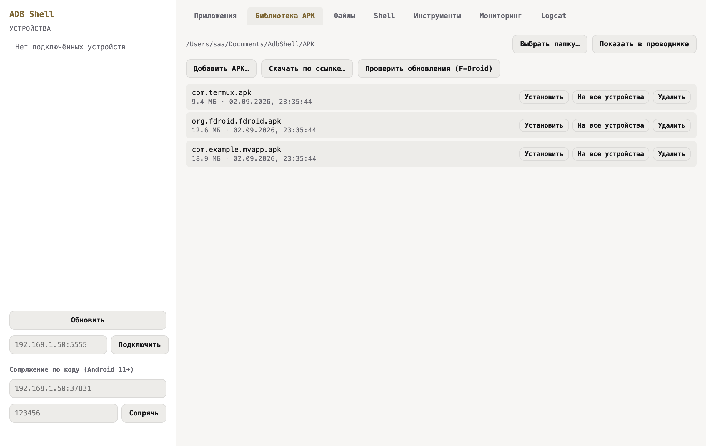
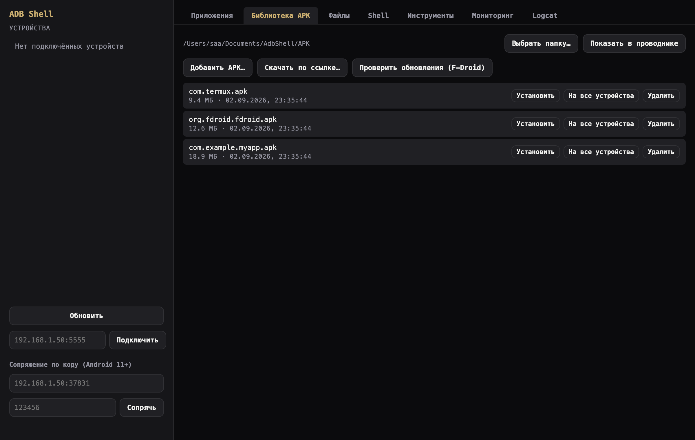

# ADB Shell

[](https://github.com/andrei-s96s/adb-shell/actions/workflows/build.yml)
[](https://github.com/andrei-s96s/adb-shell/releases/latest)


**Windows-, macOS- и Linux-приложение** для повседневной работы с
Android-устройствами через `adb` — по USB или по сети, с одним устройством
или сразу с несколькими: приложения и разрешения, файлы, shell, макросы,
мониторинг, зеркалирование экрана и скриншоты в одном окне вместо десятка
команд в терминале.

Бесплатно, без рекламы и без сбора данных. Если приложение полезно —
[поддержите проект донатом](https://andrei-s96s.github.io/adb-shell/) в USDT (BEP20).

<p align="center">
  
  
</p>

## Содержание

- [Скачать готовое приложение](#скачать-готовое-приложение)
- [Возможности](#возможности)
- [Разработка](#разработка)
- [Структура проекта](#структура-проекта)
- [Поддержать проект](#поддержать-проект)
- [Лицензии](#лицензии)

## Скачать готовое приложение

Собранные пакеты публикуются автоматически на каждый релиз:
**[скачать последнюю версию](https://github.com/andrei-s96s/adb-shell/releases/latest)**.

- **Windows** — `ADB Shell Setup X.Y.Z.exe` (NSIS-инсталлятор). Windows
  SmartScreen предупредит про неизвестного издателя (сборка не подписана
  платным сертификатом) — «Дополнительно» → «Выполнить в любом случае».
  `adb.exe`, `aapt2.exe` и `scrcpy.exe` вшиты прямо в установщик, отдельно
  ставить Android Platform Tools не нужно.
- **macOS 13 (Ventura) и новее** — отдельный архив на каждую архитектуру,
  а не один общий universal-файл (который тащил бы вдвое больше байт, чем
  нужно любому конкретному Mac): `ADB Shell-X.Y.Z-arm64-mac.zip` для Apple
  Silicon, `ADB Shell-X.Y.Z-x64-mac.zip` для Intel. Не подписано платным
  Apple Developer ID, поэтому при первом запуске Gatekeeper покажет
  предупреждение — правый клик по `ADB Shell.app` → «Открыть» → «Открыть»
  в диалоге. `adb`, `aapt2` и `scrcpy` вшиты прямо в сборку, отдельно
  ставить Android Platform Tools не нужно.
- **Linux** — `ADB-Shell-X.Y.Z.AppImage` (x86_64). Дать файлу права на
  выполнение (`chmod +x`) и запустить — установка не нужна. `adb`, `aapt2`
  и `scrcpy` вшиты прямо в сборку, отдельно ставить Android Platform Tools
  не нужно.

Приложение проверяет наличие новой версии при каждом запуске и показывает
баннер с кнопкой «Скачать и установить» — скачивает нужный под вашу
платформу файл релиза и сразу готовит к установке (на Windows — запускает
установщик, на macOS — распаковывает и снимает карантин с `.app`, на Linux
— делает `AppImage` исполняемым), последний шаг (подтвердить
SmartScreen/Gatekeeper, перетащить `.app` в Applications) — по-прежнему
вручную: полноценное молчаливое автообновление ненадёжно без платного
сертификата (Squirrel.Mac/NSIS-автообновления рассчитаны на него).

## Возможности

### 📱 Устройства и подключение

- Список подключённых устройств: USB и сеть (`adb connect ip:port`),
  mDNS-автообнаружение устройств с беспроводной отладкой в локальной сети
- Сопряжение по коду (Android 11+, `adb pair`)
- История подключений: все устройства, хотя бы раз увиденные в `adb
  devices` (в т.ч. давно отключённые сетевые), с временем последнего
  появления, автодополнением host в поле подключения и повторным
  подключением в один клик
- Собственные имена устройств (никнеймы по serial), закреплённые вкладки
  для быстрого переключения между несколькими устройствами
- «Сопряжение по коду» и «Профили подключения» свёрнуты по умолчанию —
  список устройств (самое важное в сайдбаре) не приходится проматывать
  вниз, чтобы его увидеть
- Профили подключения с автоподключением при запуске — и не только: обрыв
  связи с сетевым устройством в процессе работы (роутер перезагрузился,
  устройство заснуло) тоже замечается и переподключение пробуется само,
  без ручного «Подключить» (устройство, отключённое явно самим
  пользователем, автопереподключение не трогает)
- Перезапуск adb-сервера (`adb kill-server` + `adb start-server`) одной
  кнопкой — самое частое реальное лекарство, если adb не видит устройства
- Заметная индикация проблемных состояний устройства (offline/не
  авторизовано/нет прав доступа) — цветная рамка строки + значок с
  подсказкой, что именно делать, а не просто техническое слово статуса
- Теги устройств (как у макросов и Библиотеки APK): произвольные метки по
  serial, переживают переподключение; чипы-фильтр над списком сужают его
  до устройств с выбранным тегом
- Этот же фильтр по тегу сужает и все операции «на все устройства»
  (broadcast, зеркалирование, скриншот со всех, установка APK на все,
  запуск макроса на всех) — «все» значит именно то множество устройств,
  что сейчас видно в сайдбаре под фильтром, а не буквально каждое
  подключённое

### 📦 Приложения

- Список установленных приложений (пользовательские / системные) с поиском
  и реальными иконками из APK (через вшитый `aapt2`)
- Детали приложения: версия, target SDK, даты установки/обновления, путь к
  APK, выдача/отзыв runtime-разрешений, сетевой трафик (RX/TX) в реальном
  времени
- Установка / удаление, force stop, очистка данных, включение/отключение;
  пакетная установка, удаление, force stop, очистка данных и
  включение/отключение сразу нескольких выбранных приложений
- Множественный выбор в стиле Finder/Explorer: клик, ⌘/Ctrl-клик, ⇧-клик
- Drag&drop `.apk`-файла в любое место окна — установка на выбранное
  устройство
- **Наборы приложений**: экспорт нескольких выбранных приложений вместе с
  их runtime-разрешениями в один `.zip`, импорт на другом устройстве одним
  кликом
- **Снапшот устройства**: одной кнопкой снимает все пользовательские
  приложения с разрешениями в `.zip`, восстановление на любом устройстве в
  один клик; не больше 5 снапшотов на одно устройство — старые лишние
  удаляются автоматически при снятии нового; сравнение любых двух снапшотов
  между собой — какие пакеты появились/пропали, изменились версия или
  выданные разрешения
- Сравнение списков установленных пакетов между двумя устройствами, вместе
  со сводкой по getprop (модель, производитель, версия Android, SDK, патч
  безопасности) — расходящиеся значения подсвечены
- Экспорт APK установленного приложения обратно на компьютер
- Экспорт списка установленных пакетов в CSV

### 🗂 Библиотека APK

Работает и без подключённого устройства:

- Локальная папка (по умолчанию `Documents/AdbShell/APK`, путь можно
  сменить), добавление файлов (кнопкой или drag&drop) и скачивание по
  прямой ссылке
- Установка на выбранное устройство; множественный выбор файлов чекбоксами
  и пакетная установка на текущее устройство или сразу на все подключённые,
  с отчётом об успехах/ошибках по каждому
- Произвольные теги для файлов и фильтр списка по тегу
- Просмотр манифеста через `aapt2` (package, версия, SDK, разрешения) без
  установки на устройство, с diff версий и разрешений против уже
  установленной на устройстве версии
- Проверка подписи файла: sha256 всего APK (надёжный слепок для сверки "тот
  ли самый файл") плюс, если удалось извлечь, сертификат подписи —
  издатель, срок действия, отпечаток
- Проверка обновлений через официальный каталог **F-Droid**
- Поиск устаревших дублей: находит файлы, для которых в той же библиотеке
  уже лежит более новая версия того же пакета, с быстрым выбором всех
  найденных для удаления

### 🗄 Файлы устройства

Навигация по файловой системе устройства с поиском, push (кнопка и
drag&drop) и pull, создание папок, множественный выбор и удаление сразу
нескольких файлов.

### 💻 Shell, макросы и автоматизация

- Shell-раннер (`adb shell <команда>`) с персистентной историей, избранным
  и автодополнением ввода по истории; кнопка «Отмена» прерывает зависшую
  команду без перезапуска всего приложения
- Broadcast-режим: выполнить команду сразу на всех подключённых устройствах
- Тестер deep link/intent с сохранёнными пресетами
- Wi-Fi отладка в один клик (`adb tcpip`), проброс портов (`adb forward`/
  `adb reverse`), просмотр всех системных свойств устройства с поиском
- Макросы — именованные последовательности adb-команд, запускаются одной
  кнопкой; переменные `${ИМЯ}`, остановка на первой ошибке, автозапуск при
  подключении устройства ИЛИ по расписанию (каждые N минут, независимо от
  открытой вкладки), импорт/экспорт JSON; результат каждого шага виден
  живьём по мере выполнения, не только по завершении всего макроса
- Управление порядком выполнения в макросе: шаги-задержки (пауза заданной
  длительности перед следующим шагом) и условные шаги («выполнить только
  если предыдущий шаг завершился успешно/с ошибкой») — редактируются в
  структурном списке шагов с перестановкой ▲/▼, отдельно от вставки целого
  скрипта одним куском
- Глобальный хоткей для макроса (работает даже когда окно не в фокусе, как
  и хоткей скриншота): назначается прямо в редакторе макроса, бейдж
  ⌨/⌨⚠ в списке показывает, реально ли сейчас активен назначенный хоткей;
  недоступно макросам с переменными `${ИМЯ}`, спросить их некому без
  открытого окна
- Теги макросов (как в Библиотеке APK): произвольные метки прямо на
  карточке макроса, чипы-фильтр над списком сужают его до макросов с
  выбранным тегом
- Запуск макроса сразу на всех подключённых и готовых устройствах, не
  только на одном выбранном — переменные ${ИМЯ} спрашиваются один раз на
  весь батч
- Журнал запусков макросов: кто/когда/на каком устройстве запускал и чем
  закончилось (в т.ч. результат по каждому шагу), переживает перезапуск
  приложения — отдельно от результата текущего запуска на самом экране
- Быстрый поиск ⌘K/Ctrl+K: переключение вкладки, выбор устройства, запуск
  макроса — без мыши

### 📊 Мониторинг и диагностика

- Живые графики CPU и памяти, уровень и температура батареи
- Список процессов с поиском и завершением (`kill`)
- Карточка «Безопасность»: Verified Boot, блокировка bootloader, признаки
  root, debuggable-сборка, статус Play Protect
- Экранное время приложений (`dumpsys usagestats`)
- Просмотр ANR/tombstone-файлов устройства
- Полный диагностический архив устройства в один клик (`adb bugreport`) —
  логи, dumpsys, состояние системы целиком; можно прервать, если это
  надолго
- Экспорт истории мониторинга в CSV, пороговые уведомления при высоком CPU
  и низком заряде батареи

### 🖥 Экран и медиа

- Скриншот с превью в приложении (копировать в буфер / сохранить как);
  скриншот сразу со всех подключённых устройств в выбранную папку
- Глобальный хоткей (по умолчанию Ctrl/Cmd+Shift+S, сочетание настраивается
  в Настройках) — тихий скриншот выбранного устройства из любого
  приложения; бейдж ⌨/⌨⚠ показывает, реально ли сейчас активно указанное
  сочетание (может быть занято другим приложением/ОС)
- Зеркалирование экрана в реальном времени через вшитый `scrcpy`, запись
  сессии в `.mp4`, зеркалирование сразу всех подключённых устройств плиткой
  по экрану
- Live Logcat: стриминг `adb logcat`, фильтр по тексту/тегу/уровню,
  подсветка по уровню, автопрокрутка, очистка буфера устройства, экспорт
  отфильтрованного вида в текстовый файл

### ⚙️ Интерфейс и настройки

- **Русский и English** — переключатель прямо в сайдбаре (виден с первого
  экрана, без подключённого устройства) и во вкладке «Настройки»; при первом
  запуске язык угадывается по языку системы. Смена языка сохраняется и сразу
  перезагружает окно интерфейса — без перезапуска всего приложения
- Тема оформления следует системной (светлая/тёмная)
- **Демо-режим** — одно виртуальное устройство без реального adb/устройства:
  посмотреть весь функционал (приложения, файлы, Shell, макросы,
  мониторинг, Logcat) до того, как под рукой оказался настоящий Android
- Проверка обновлений приложения на GitHub Releases, с кнопкой «Скачать и
  установить» прямо из баннера (с процентом загрузки на файле в сотни МБ)
- Настройки: автопроверка обновлений, системные приложения по умолчанию,
  быстрая очистка истории shell/профилей подключения

## Разработка

```bash
npm install
npm start
```

**Тесты** — юнит-тесты на чистую бизнес-логику и парсинг (без Electron),
встроенным тест-раннером Node, без Jest/Vitest:

```bash
npm test
```

**Сборка пакетов** (`electron-builder`):

```bash
npm run dist:mac    # ADB Shell-X.Y.Z-{x64,arm64}-mac.zip (два отдельных файла)
npm run dist:win    # ADB Shell Setup X.Y.Z.exe (NSIS)
npm run dist:linux  # ADB-Shell-X.Y.Z.AppImage (x86_64)
```

**Релиз** — заметки к GitHub-релизу собираются из [CHANGELOG.md](CHANGELOG.md)
(`scripts/changelog-extract.js`), а не автогенерируются GitHub'ом из списка
коммитов. Перед тегом релиза: перенести содержимое `[Unreleased]` в новую
секцию `## [X.Y.Z] - YYYY-MM-DD`, закоммитить, затем поставить тег
`vX.Y.Z` — `.github/workflows/release.yml` подхватит его сам. Если секции
для версии тега не найдётся, релиз-workflow упадёт явной ошибкой, а не
опубликует релиз без заметок.

## Структура проекта

```
src/
  main/
    main.ts             — точка входа Electron, окно, IPC-хендлеры,
                          глобальный перехват необработанных ошибок
    preload.ts          — contextBridge, единственный мост renderer → main
    updateChecker.ts    — проверка новых версий по GitHub Releases
    updateInstaller.ts  — скачивание + подготовка файла обновления к установке
    adb/
      AdbService.ts     — обёртка над CLI adb
      demo/             — демо-режим: виртуальное устройство без adb
                          (см. DemoAdbService.ts — единственная точка
                          перехвата поверх AdbService.run())
      parsers/          — чистые функции парсинга adb-вывода
      types/
    apkLibrary/         — локальный каталог APK, aapt2, F-Droid, теги
    appBundles/         — экспорт/импорт наборов приложений (zip)
    appIcons/           — реальные иконки приложений из APK
    connectionProfiles/ — сохранённые host + автоподключение
    deviceHistory/      — история подключений (все увиденные serial'ы)
    deviceNicknames/    — пользовательские имена устройств
    devicePins/         — закреплённые вкладки устройств
    deviceTags/         — теги устройств по serial
    deviceSnapshots/    — снапшоты устройства
    intentPresets/      — сохранённые deep link/intent
    macros/             — движок макросов + хранилище
    macroRunHistory/    — журнал запусков макросов
    monitoring/         — пороговые уведомления CPU/батарея
    screenMirror/       — зеркалирование экрана через scrcpy
    settings/           — настройки приложения
    shellHistory/       — история shell-команд + избранное
    util/               — потоковое скачивание с прогрессом, форматирование
                          времени -- общие мелочи без своего домена
  renderer/
    index.html
    api.ts              — типизированная обёртка над window.adbApi
    state.ts            — текущее выбранное устройство + подписка
    tabs.ts             — переключение вкладок
    renderer.ts         — точка входа, список устройств, глобальный drag&drop
    modal.ts            — переиспользуемый оверлей для модальных окон
    i18n.ts, i18nDictionary.ts, i18nApplyHtml.ts, localeSwitch.ts
                        — локализация (ru/en): t(), словарь переводов,
                          применение к статичной разметке, переключатель
    screens/            — по одному модулю на вкладку/модалку
    styles/theme.css    — цветовая палитра приложения
  test/                 — юнит-тесты (node --test)
scripts/
  fetch-adb.js          — скачивает adb (mac/win/linux, + DLL для Windows)
  fetch-aapt2.js        — скачивает aapt2 (mac/win/linux) для чтения манифестов
  fetch-scrcpy.js       — скачивает scrcpy (mac/win/linux) для зеркалирования
                          экрана; на macOS дополнительно сшивает x86_64+arm64
                          в один universal-бинарник через lipo
  afterSign.js          — electron-builder hook: дошивает подпись macOS
                          после упаковки ресурсов (без этого Gatekeeper
                          жёстко отклоняет собранный .app)
build/                  — иконки (icon.ico/icon.icns/icon.png)
```

## Поддержать проект

Адрес USDT (BEP20) и QR-код — прямо в приложении, вкладка **«Донат»** (или
на **[отдельной странице](https://andrei-s96s.github.io/adb-shell/)**, если
удобнее скопировать адрес без запуска приложения).

## Лицензии

Исходный код самого ADB Shell распространяется под лицензией **MIT** — см.
[LICENSE](LICENSE). Бесплатно для любого использования, в том числе
коммерческого, без гарантий.

`adb` и `aapt2` — части Android Platform Tools / Android Gradle Plugin от
Google, `scrcpy` — проект Genymobile; все три распространяются под Apache
License 2.0, сборки кладут рядом соответствующие `NOTICE`/`LICENSE`-файлы.
