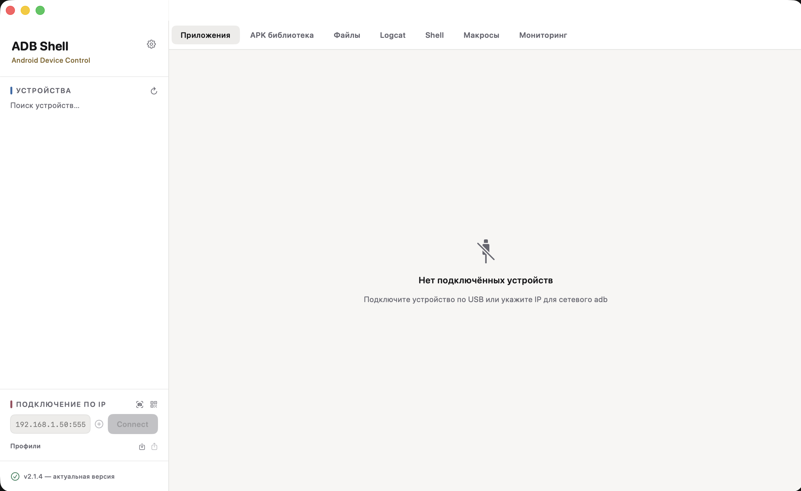
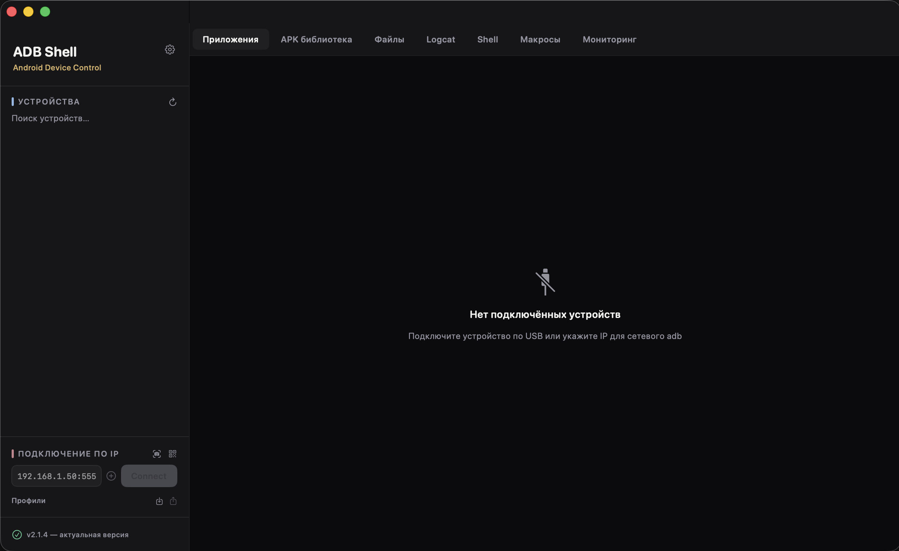

# ADB Shell

[](https://github.com/andrei-s96s/adb-shell/actions/workflows/build.yml)
[](https://github.com/andrei-s96s/adb-shell/releases/latest)


Нативное macOS-приложение (SwiftUI) для повседневной работы с Android-устройствами
через `adb` — по USB или по сети, с одним устройством или сразу с несколькими:
приложения и разрешения, файлы, shell, логи, макросы, мониторинг и скриншоты
в одном окне вместо десятка команд в терминале.

Бесплатно, без рекламы и без сбора данных. Если приложение полезно —
[поддержите проект донатом](https://andrei-s96s.github.io/adb-shell/) в USDT (BEP20).

<p align="center">
  
  
</p>

## Содержание

- [Скачать готовое приложение](#скачать-готовое-приложение)
- [Возможности](#возможности)
- [Требования](#требования)
- [Разработка](#разработка)
- [Структура проекта](#структура-проекта)
- [Поддержать проект](#поддержать-проект)
- [Лицензии](#лицензии)

## Скачать готовое приложение

Собранная `.app` публикуется автоматически на каждый релиз:
**[скачать последнюю версию](https://github.com/andrei-s96s/adb-shell/releases/latest)**
(файл `AdbShell-macOS.zip`).

`adb` (Android Platform Tools), `scrcpy` (Genymobile) и `aapt2` (Android Gradle
Plugin) вшиты прямо в `.app` — отдельно ставить их на Mac не нужно, ничего
больше скачивать не требуется.

Приложение не подписано платным Apple Developer ID и не нотаризовано, поэтому
при первом запуске Gatekeeper может отказать. Снять карантин после распаковки:

```bash
xattr -cr AdbShell.app
```

и/или через Finder: правый клик по `AdbShell.app` → «Открыть» → «Открыть» в
диалоге предупреждения. Дальше приложение само проверяет обновления при
запуске и предлагает поставить новую версию в один клик (кнопка «Проверить
обновления» / баннер в сайдбаре).

## Возможности

### 📱 Устройства и подключение

- Список подключённых устройств: USB и сеть (`adb connect ip:port`),
  mDNS-автообнаружение устройств с беспроводной отладкой в локальной сети
- Сопряжение по коду (Android 11+)
- Профили подключения с автоподключением при запуске, закреплённые вкладки
  для быстрого переключения между несколькими устройствами
- Собственные имена устройств (контекстное меню в сайдбаре), индикатор
  версии/сборки Android в шапке
- Быстрые действия: reboot recovery/bootloader, `adb root`/`remount`

### 📦 Приложения

- Список установленных приложений (пользовательские / системные) с поиском
  и реальными иконками из APK (через вшитый `aapt2`)
- Детали приложения: версия, target SDK, даты установки/обновления, путь к
  APK, выдача/отзыв runtime-разрешений
- Установка / удаление, force stop, очистка данных, включение/отключение;
  пакетная установка и удаление сразу нескольких приложений с отчётом
- Множественный выбор в стиле Finder: клик, ⌘-клик, ⇧-клик — без отдельного
  «режима выбора»
- Drag&drop `.apk`-файла в любое место окна — установка на выбранное
  устройство без похода во вкладку «APK библиотека»
- Установка APK сразу на все подключённые устройства одним кликом
- **Наборы приложений**: экспорт нескольких выбранных приложений вместе с их
  runtime-разрешениями в один `.zip`, импорт на другом устройстве одним
  кликом — приложения ставятся и сразу получают те же разрешения
- **Снапшот устройства**: одной кнопкой снимает сразу все пользовательские
  приложения с разрешениями (без ручного выбора) и хранит `.zip` локально на
  Mac — восстановить на любом устройстве потом можно в один клик
- Сравнение списков установленных пакетов между двумя устройствами
- Проверка обновлений через официальный каталог **F-Droid** — бейдж с
  доступной версией, обновление ставится только по явному нажатию кнопки
- Экспорт списка установленных пакетов в CSV

### 🗂 Библиотека APK

- Локальная папка (по умолчанию `~/Documents/AdbShell/APK`, путь можно
  сменить) — доступна и без подключённого устройства
- Импорт `.apk`-файлов drag&drop, установка на устройство в один клик
- Скачивание APK напрямую по ссылке (например, из внутреннего CI)
- Произвольные теги для файлов и фильтр списка по тегу
- Просмотр манифеста через `aapt2` (package, версия, SDK, разрешения) без
  установки на устройство, с diff версий и разрешений против уже
  установленной на устройстве версии
- Проверка обновлений на F-Droid и для файлов в библиотеке — не только для
  уже установленных приложений

### 🗄 Файлы устройства

- Навигация по файловой системе устройства с хлебными крошками и поиском
- Push (кнопка или drag&drop) и pull, создание папок, удаление
- Экспорт APK установленного приложения обратно на Mac

### 💻 Shell, макросы и автоматизация

- Shell-раннер (`adb shell <команда>`) с персистентной историей и избранным
- Broadcast-режим: выполнить команду сразу на всех подключённых устройствах
- Ввод текста в поле с фокусом на устройстве, тестер deep link/intent с
  сохранёнными пресетами
- Wi-Fi отладка в один клик (`adb tcpip`) — переключает подключённое по USB
  устройство в сетевой режим и показывает IP:порт для подключения
- Проброс портов (`adb forward`/`adb reverse`) — список активных правил,
  добавление и удаление прямо в интерфейсе
- Просмотр всех системных свойств устройства (`adb shell getprop`) с поиском
  по ключу или значению
- Вкладка «Макросы» — именованные последовательности adb-команд (например,
  порядок действий при прошивке), запускаются одной кнопкой; при создании
  можно вставить целиком `.bat`-скрипт — строки, не начинающиеся с `adb`,
  игнорируются автоматически
- Переменные `${ИМЯ}` и остановка на первой ошибке в макросах, автозапуск
  макроса при подключении устройства
- Экспорт/импорт макросов и профилей подключения в JSON — перенос настроек
  между машинами
- Быстрый поиск ⌘K: переключение вкладки, выбор устройства, запуск
  макроса — без мыши

### 📊 Мониторинг и диагностика

- Живые графики загрузки CPU и памяти, уровень и температура батареи —
  опрос каждые 2 секунды
- Список процессов (`ps -A`) с поиском и завершением (`kill`)
- Карточка «Безопасность»: Verified Boot, блокировка bootloader, признаки
  root, debuggable-сборка, статус Play Protect
- Мониторинг сетевого трафика приложения (RX/TX и суммарный трафик по UID)
  прямо в деталях приложения
- Экранное время приложений (`dumpsys usagestats`)
- Просмотр ANR/tombstone-файлов устройства
- Экспорт истории мониторинга в CSV, пороговые уведомления при высоком CPU
  и низком заряде батареи

### 🖥 Экран и медиа

- Скриншот с превью в приложении (копировать в буфер / сохранить как)
- Глобальный хоткей ⌘⇧S — скриншот выбранного устройства из любого
  приложения (требует разрешения «Мониторинг ввода»)
- Зеркалирование экрана в реальном времени через вшитый `scrcpy`, запись
  сессии в `.mp4`
- Зеркалирование сразу всех подключённых устройств плиткой по экрану
- Live Logcat: стриминг `adb logcat`, фильтр по тексту/уровню, подсветка
  ошибок, автопрокрутка

### ⚙️ Интерфейс и настройки

- Тема оформления: Системная / Светлая / Тёмная
- Интерфейс полностью локализован на русский и английский, переключение в
  Настройках без перезапуска
- Системные macOS-уведомления о завершении долгих операций (пакетная
  установка/удаление, установка на все устройства, прогон макроса)
- Проверка обновлений приложения на GitHub Releases и самообновление в
  один клик

## Требования

Для готового релиза (см. выше) — только macOS 13+, ничего ставить не нужно.

Для сборки из исходников:

- macOS 13+
- Swift 5.9+ (входит в Command Line Tools, Xcode не обязателен)
- `adb` в `PATH` только для `swift run` (например,
  `brew install android-platform-tools`) — `build_app.sh` сам скачивает и
  вшивает `adb` в `.app`, системный нужен лишь для запуска через `swift run`

## Разработка

**Запуск в режиме разработки:**

```bash
swift run
```

**Тесты:**

```bash
swift test
```

Юнит-тесты покрывают парсинг `dumpsys package` (версии, runtime/install-time
разрешения), парсинг `adb devices -l`, склейку списка пакетов и сравнение
версий для автообновления. На машине без полного Xcode (только Command Line
Tools) `swift test` может не найти модуль `Testing` — это ограничение
локального окружения, в CI (GitHub Actions, полный Xcode) тесты гоняются
штатно на каждый push.

**Сборка `.app`:**

```bash
./build_app.sh
open AdbShell.app
```

Скрипт собирает release-бинарник, скачивает (кеширует в `.build/`) и вшивает
`adb` из официальных Android Platform Tools, `scrcpy` из официальных релизов
Genymobile и `aapt2` из Maven-репозитория Google, упаковывает всё в
`AdbShell.app` с ad-hoc подписью — можно перетащить в `/Applications` и
запускать двойным кликом.

## Структура проекта

```
Sources/AdbShell/
  Models/       — Device, InstalledApp, AppDetail, AppPermission, ApkFile, AppBundleManifest, RemoteFile, Macro
  Services/     — ADBService (обёртка над CLI adb), DumpsysParser, UpdateService, ZipUtil,
                  ScreenMirrorService (запуск вшитого scrcpy), MacroStore, IconService (иконки из APK через aapt2)
  ViewModels/   — DevicesViewModel, AppsViewModel, AppDetailViewModel, ApkLibraryViewModel, FilesViewModel, LogcatViewModel
  Views/        — ContentView, DeviceSidebarView, AppsView, AppDetailPanel, ApkLibraryView, FilesView, LogcatView, ShellRunnerView, MacroView, SettingsView
  Design/       — Theme.swift (цветовая палитра и компоненты), QRCode.swift (QR через CoreImage)
  Localization/ — L10n.swift (LocalizationManager + функция L()), ru.lproj/en.lproj Localizable.strings
Tests/AdbShellTests/ — юнит-тесты (Swift Testing)
```

См. [ROADMAP.md](ROADMAP.md) — план развития по версиям.

## Поддержать проект

**[Страница доната](https://andrei-s96s.github.io/adb-shell/)** — адрес USDT
(BEP20) и QR-код, чтобы не вводить его вручную. То же самое — с QR прямо в
приложении — есть в Настройках → «Поддержать проект».

## Лицензии

`adb` — часть Android Platform Tools от Google, распространяется под
Apache License 2.0; при сборке `.app` рядом кладётся `adb-NOTICE.txt` с
атрибуцией. `scrcpy` — проект Genymobile, тоже Apache License 2.0; при сборке
рядом кладётся `scrcpy-LICENSE.txt`. `aapt2` — часть Android Gradle Plugin от
Google, тоже Apache License 2.0; при сборке рядом кладётся
`aapt2-NOTICE.txt`.

Лицензия на исходный код самого ADB Shell в репозитории отдельно не указана.
